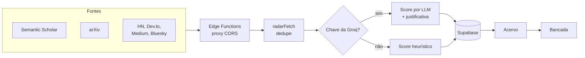

# Summa.sh

Plataforma de gestão de pesquisa acadêmica: encontra literatura relevante para o seu tema, organiza as referências e as leituras e reúne a escrita dos artigos em um só lugar.

<div align="center">


</div>

<!-- Adicionar aqui 2 ou 3 capturas de tela: Farol com os scores, grafo de referências na Home e leitor de PDF. -->

## Sobre

No mestrado, o material de pesquisa fica espalhado: papers baixados numa pasta, links salvos em outra ferramenta, anotações no caderno, o artigo num editor de LaTeX e os alertas de publicação no e-mail. O Summa.sh nasceu para juntar esse ciclo em uma plataforma pensada para uso próprio durante a pesquisa.

O projeto foi desenvolvido entre julho e agosto de 2026 e está pausado. Os módulos Farol e Acervo, os mais maduros, devem seguir como um produto próprio.

## Módulos

| Módulo | O que faz | Estado |
|---|---|---|
| **Farol** | Radar de literatura com classificação de relevância | Funcional |
| **Acervo** | Referências, pastas e leitura de PDFs com anotações | Funcional |
| **Bancada** | Editor de documentos acadêmicos com exportação para LaTeX | Funcional |
| **Home** | Painel com o grafo de referências | Funcional |
| **Pauta** | Kanban, milestones e prazos | Planejado |
| **Vitrine** | Portfólio acadêmico público | Planejado |
| **Dataset** | Gestão do pool de repositórios da pesquisa | Planejado |

### Farol

O Farol busca publicações em várias fontes e dá a cada uma uma nota de relevância com base no perfil do pesquisador.

**Fontes ativas:** Semantic Scholar e arXiv (acadêmicas), Hacker News, Dev.to, Medium e Bluesky (comunidade). IEEE Xplore, ACM, Google Scholar e X estão mapeados, mas dependem de acesso institucional ou chave de API.

**Como a relevância é calculada:**

1. No onboarding, o pesquisador informa programa, instituição, área, subárea, título da dissertação, palavras-chave e termos que quer ignorar.
2. Cada item novo vai para um LLM (Groq, Llama 3) com esse perfil e uma rubrica explícita de pontuação:

| Score | Significado |
|---|---|
| 90–100 | Diretamente sobre o tema central da pesquisa |
| 70–89 | Tema adjacente que fundamenta ou complementa a pesquisa |
| 50–69 | Compartilha conceitos ou métodos, em outro domínio |
| 30–49 | Menciona termos relacionados, mas o foco é outro |
| 0–29 | Fora do escopo, tutorial genérico ou conteúdo superficial |

3. O modelo devolve um JSON com o score, uma justificativa de 1 a 2 frases e as palavras-chave do perfil que de fato aparecem no item.
4. Se não houver chave da Groq ou a chamada falhar, entra uma **pontuação heurística**: o item é descartado se tiver um termo ignorado ou nenhuma palavra-chave, e ganha mais pontos quando a palavra-chave aparece no título do que no resumo.

Os itens são deduplicados pela URL de origem ou pelo título normalizado, que ignora caixa, pontuação e artigos, porque o mesmo paper costuma aparecer em mais de uma fonte.

As fontes são acessadas por duas Edge Functions do Supabase, `external-search` e `rss-proxy`, que funcionam como proxy para contornar o bloqueio de CORS dos navegadores.

### Acervo

- **Referências** de vários tipos (paper, livro, tese, dataset, post, thread, notícia, chamada de trabalhos), com pastas, tags e favoritos.
- **Dossiê** de cada referência, com o PDF, os links e a citação pronta.
- **Citações** em ABNT (NBR 6023:2018) e APA (7ª edição), e exportação para BibTeX e RIS.
- **Leitura de PDFs** no navegador, sem backend: o leitor extrai os capítulos pelo sumário do PDF, permite exportar cada capítulo como um PDF separado e registra anotações, marca-texto e progresso de leitura.
- **Priorização de capítulos:** cada capítulo recebe uma prioridade (alta, média, baixa ou pular) contando quantas vezes as palavras-chave da pesquisa aparecem no texto. Em um livro longo, isso mostra por onde começar.

### Bancada

- Editor rico (TipTap) com tabelas, marca-texto e barra lateral de referências do Acervo.
- Templates de artigo IEEE, ACM e SBC, além de pôster e documento livre, cada um com as seções esperadas.
- Conversor próprio do formato do TipTap para LaTeX, com escape de caracteres especiais, e exportação para `.tex` e `.md`.
- Histórico de versões do documento.

### Home

Um grafo de referências conecta itens do Acervo que compartilham tags. O layout usa uma simulação de forças (repulsão, atração e gravidade central) escrita sem biblioteca externa e calculada uma vez, não a cada quadro.

## Arquitetura

| Camada | Tecnologia |
|---|---|
| Interface | React, Vite, React Router, CSS Modules e Tailwind |
| Estado | Redux Toolkit |
| Editor | TipTap |
| PDF | pdf.js (leitura) e pdf-lib (exportação de capítulos) |
| Backend | Supabase: PostgreSQL, Auth, Storage, Edge Functions e RLS |
| IA | Groq (Llama 3) |
| Distribuição | PWA |



### Camada de dados

O acesso a dados passa por repositórios (`src/services/repositories*.js`), e os componentes não chamam o Supabase diretamente. Essa camada permitiu migrar a primeira versão, que guardava tudo no navegador com Dexie (IndexedDB), para o Supabase sem reescrever as telas.

O banco tem cerca de 30 tabelas, organizadas por domínio: perfil e configurações, fontes e radar, referências e pastas, leitura (livros, capítulos, progresso e anotações), documentos e versões, e tarefas e milestones.

### Estrutura de pastas

```
src/
├── components/   # um diretório por módulo: farol, acervo, bancada, home...
├── services/     # repositórios de dados, radar, templates e conversor LaTeX
├── lib/          # IA, citações, motor de PDF, grafo, fontes do Farol
├── store/        # Redux Toolkit: auth e dados
└── db/           # schema e seed da versão local (Dexie)
supabase/functions/   # Edge Functions: external-search e rss-proxy
scripts/              # backfill de papers, livros e posts para o Acervo
```

## Rodando localmente

Requisitos: Node.js 20 e Yarn.

```bash
yarn
yarn dev
```

Variáveis de ambiente (`.env`):

| Variável | Uso |
|---|---|
| `VITE_SUPABASE_URL` | URL do projeto Supabase |
| `VITE_SUPABASE_ANON_KEY` | Chave pública do Supabase |

A chave da Groq é pessoal e fica na tela de Configurações. Sem ela, o Farol usa a pontuação heurística.

Os scripts em `scripts/` populam o Acervo com papers, livros e posts antigos, acessando as fontes direto do terminal:

```bash
node scripts/backfill-papers.mjs
```

## Limitações conhecidas

- **Schema incompleto no repositório:** `supabase-migration.sql` só adiciona colunas e políticas a tabelas que já existem. O script de criação do banco não está versionado.
- **Funções de IA sem tela:** `src/lib/ai.js` tem funções para sugestões de escrita, geração de abstract, informe semanal, sugestão de citações e classificação de repositórios, mas só a análise de relevância do Farol e o preenchimento do perfil do orientador estão ligados à interface.
- **Chave no navegador:** a chave da Groq fica no `localStorage`, e as chamadas ao modelo saem do navegador.
- **Modelo da Groq:** o modelo configurado é o `llama-3.1-70b-versatile`. Se ele não estiver mais disponível na Groq, o Farol passa a usar só a pontuação heurística, sem mostrar erro.

## Licença

© 2026 Samara Silvia Sabino. Todos os direitos reservados.

Este repositório é público apenas para consulta e avaliação como portfólio. Não é permitido copiar, modificar, distribuir ou usar o código, total ou parcialmente, sem autorização por escrito da autora. Veja os termos completos em [LICENSE](LICENSE).

## Autora

**Samara Silvia Sabino** · Desenvolvedora Frontend e UX/UI · Mestranda em Engenharia de Software no CIn/UFPE

[LinkedIn](https://www.linkedin.com/in/samara-silvia-9a2a26231) · [GitHub](https://github.com/SamaraSilvia81) · [Portfólio](https://samarasilviadev.vercel.app)
